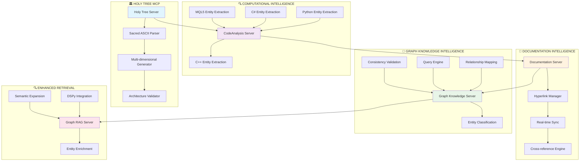
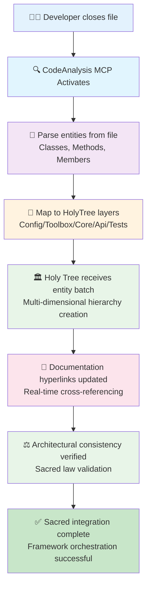

# 🏛️ HOLY TREE ARCHITECTURE

**"Where Sacred Architecture Meets Computational Intelligence"**

A revolutionary development framework that combines the divine wisdom of ASCII tree structures with MCP-powered computational intelligence to govern software architecture with sacred law.

## 🕍 SUPREME PHILOSOPHY

**All architectural decisions flow from THE HOLY TREE** - a living ASCII structure that governs project creation, enforces quality standards, and maintains architectural purity through sacred knowledge graphs and real-time entity management.

## 🌳 CORE COMPONENTS

### 🏛️ Holy Tree MCP
**Supreme Architectural Authority**
- Parses the sacred ASCII tree structure
- Multi-dimensional hierarchy management
- Living architecture validation
- Entity birth/death rites

### 🔍 CodeAnalysis Server MCP
**Computational Entity Extraction**
- File-closed event processing
- Multi-language entity detection (C++, Python, C#, MQL5)
- Visibility level analysis (public/private/protected)
- Method signature parsing and parameter extraction

### 🔗 Documentation MCP
**Real-time Hyperlinking System**
- Live documentation cross-references
- Entity traceability navigation
- Documentation MCP coordination
- Multi-format hyperlink management

### 🧠 Graph Knowledge MCP
**Entity Relationship Intelligence**
- Entity classification and taxonomy
- Relationship mapping and queries
- Architectural consistency validation
- Knowledge graph construction from requirements

### 🔍 Graph RAG MCP - 🏆 COMPUTATIONAL INTELLIGENCE ENGINE
**Enhanced Semantic Retrieval with HOLY TREE INTELLIGENCE**
- **📊 Domain-Aware Query Classification**: Automatically determines if queries are software/trading/architecture/cross-domain
- **🎯 Response Strategy Selection**: DEFERMINISTIC → GRAPH REASONING → HYBRID ANALYSIS → GENERATIVE SYNTHESIS algorithms
- **🔗 Entity Relationship Mapping**: Provides multi-hop reasoning through entity relationship graphs
- **⚖️ Architectural Consistency Validation**: Validates queries against HOLY TREE sacred laws
- **🧠 DSPy-Powered LLM Integration**: Contextual response generation with entity enrichment
- **🔍 Context-Aware Entity Discovery**: Finds relevant patterns, designs, and implementations
- **📄 Documentation Hyperlink Guidance**: Recommends contextual documentation cross-references
- **🌐 Cross-Domain Knowledge Synthesis**: Combines software engineering + trading strategies

## ⚖️ SACRED ARCHITECTURAL LAWS (.clinerules/)

### The Supreme MCP Integration Directive
**ALL DEVELOPMENT ACTIVITIES MUST INTEGRATE MCP SYSTEMS FIRST**
- Holy Tree supremacy over all structural decisions
- CodeAnalysis authority on entity classifications
- Real-time documentation synchronization
- Sacred law enforcement via quality gates

### Multi-Tier Object Architecture (4 Layers)
- **Toolbox Layer**: Pure functions, no state (Layer 1)
- **PODs Layer**: Data structures, no behavior (Layer 2)
- **Stateful Layer**: Business logic, managed state (Layer 3)
- **Composition Layer**: High-level interfaces (Layer 4)

### Quality Assurance Framework
- **Zero Hardcoded Values Crusade** (Active)
- **Performance Requirements**: <1μs trading latency
- **Cross-Language Compatibility**: C++, Python, C#, MQL5
- **Automated Quality Gates**: CI/CD integration

## 🔄 WORKFLOW INTEGRATION

### 🏛️ Supreme MCP Integration Architecture



### File-Closed Sacred Ritual


### Holy Tree Entity Lifecycle Management
```mermaid
stateDiagram-v2
    [*] --> EntityDiscovery: New requirement identified

    EntityDiscovery --> Classification: Entity type determined
    Classification --> HolyTreeRegistration: Sacred ASCII tree updated

    HolyTreeRegistration --> ProjectStructureGeneration: 4-layer directories created
    ProjectStructureGeneration --> CodeImplementation: Developer workspace ready

    CodeImplementation --> FileClosedEvent: Code written and saved
    FileClosedEvent --> CodeAnalysisActivation: Multi-language entity extraction
    CodeAnalysisActivation --> HolyTreeRegistration: Multi-dimensional hierarchy updated
    HolyTreeRegistration --> DocumentationSync: Hyperlinks updated automatically

    CodeImplementation --> EvolutionaryChange: Architecture evolution needed
    EvolutionaryChange --> HolyTreeModification: Sacred ASCII structure modified
    HolyTreeModification --> CodeEntityImpact: Orphaned entities marked
    CodeEntityImpact --> ManualCleanup: Developer cleanup guidance

    DocumentationSync --> ArchitecturalPurity: Sacred law validation
    ArchitecturalPurity --> NextEntityDiscovery: Endless divine cycle

    note right of Classification : Entity Classification:\n• Core Object (full hierarchy)\n• Conceptual Entity (docs only)\n• Waitlist (future sacred)\n• Blacklist (external/ignored)

    note right of HolyTreeRegistration : Holy Tree Rules:\nASCII structure is MONETARY LAW\nAll decisions subject to Holy Tree

    note right of CodeAnalysisActivation : Code Analysis Scope:\n• Class hierarchies\n• Method signatures\n• Member visibility\n• Parameter types\n• Cross-language mappings
```

## 🏗️ PROJECT GENERATION ENGINE

### Requirements → Holy Tree ASCII Structure
```
Stakeholder requirements parsed
           ↓
Holy Tree ASCII canon created
           ↓
Multi-dimensional hierarchies generated
           ↓
4-layer project structure synthesized
           ↓
Build system templates applied
           ↓
Development environment ready
```

### Living Architecture Management
- **Real-time Validation**: Continuous architectural consistency
- **Entity Lifecycle Tracking**: Birth-to-death architectural oversight
- **Quality Monitoring**: Automated purity measurements
- **Evolution Guidance**: Development decisions subject to Holy Law

## 📊 CAPABILITIES & FEATURES

### 🔬 Computational Intelligence
- **Entity Classification Automation**: C++/Python/C#/MQL5 entity extraction
- **Visibility Analysis**: Public/private/protected member detection
- **Method Parameter Intelligence**: Signature parsing and type detection
- **Architectural Pattern Recognition**: Framework compliance validation

### 🏛️ Architectural Governance
- **Sacred ASCII Tree Parsing**: Living documentation structure
- **Multi-dimensional Hierarchies**: 4+ levels of code-to-architecture bridging
- **Entity Relationship Mapping**: Classification and taxonomy management
- **Architectural Consistency**: Real-time purity validation

### 📄 Documentation Intelligence
- **Hyperlinked Navigation**: Live cross-reference updating
- **Entity Traceability**: From requirements to code line
- **Documentation Synchronization**: Multi-format coordination
- **Context-aware Linking**: Semantic relationship awareness

### ⚡ Performance Optimization
- **Financial Trading Standards**: Sub-microsecond latency requirements
- **Memory Pool Optimization**: Zero-allocation algorithms
- **Cross-language Calls**: Optimized boundary transitions
- **Build System Integration**: CMake/Python hybrid compilation

## 🚀 QUICK START

### Framework Installation
```bash
# Clone the Holy Tree Architecture
git clone https://github.com/AlotfyDev/HOLY-TREE-ARCHITECTURE.git
cd HOLY-TREE-ARCHITECTURE

# Setup MCP servers
pip install -r requirements.txt
npm install  # GraphRAG MCP

# Configure MCP servers in VS Code
cp .mcpconfig ~/.vscode/settings.json
```

### Project Generation Ritual
```python
from HolyTree_MCP.holy_tree_server import HolyTreeMCPServer

# Initialize supreme authority
server = HolyTreeMCPServer('requirements/document.md')
await server.analyze_holy_tree()

# Generate project structure
result = await server.generate_project_structure("full")
print(f"Holy Tree has generated: {result['directories_created']} sacred directories")
```

### Integration Activation
```python
from integration_framework import CodeAnalysisHolyTreeIntegration

# Activate the sacred integration
framework = CodeAnalysisHolyTreeIntegration()

# File closure triggers holy ritual
result = await framework.on_file_closed("my_project/class.cpp")
print(f"Entities registered: {result['holy_tree_registered']}")
```

## 🗂️ REPOSITORY STRUCTURE

```
HOLY-TREE-ARCHITECTURE/
├── HolyTree_MCP/                    # 🏛️ Supreme Authority
│   ├── holy_tree_server.py         # Sacred ASCII Parser
│   └── README.md                    # Holy Tree Documentation
├── CodeAnalysisServer_MCP/          # 🔍 Entity Extraction
│   ├── mcp_server.py               # Multi-language Parsing
│   ├── requirements.txt             # Python Dependencies
│   └── README.md                    # Analysis Server Docs
├── DocumentationMCP_Server/         # 📄 Hyperlinked Docs
│   ├── documentation_server.py     # Real-time Hyperlinking
│   ├── requirements.txt             # Documentation Dependencies
│   └── README.md                    # Hyperlinking Docs
├── GraphRagMcpServer/               # 🔍 Enhanced Retrieval
│   ├── package.json                 # Node.js Dependencies
│   ├── tsconfig.json                # TypeScript Config
│   ├── src/index.ts                 # DSPy Integration
│   └── README.md                    # GraphRAG Docs
├── .clinerules/                     # 📜 Sacred Rule Documents
│   ├── MCP_Integration_First.md     # Supreme Directive
│   ├── Multi_Tier_Object_Architecture_Guide.md
│   ├── PerformanceGuidelines.md     # Trading Standards
│   ├── QualityGates.md              # Quality Assurance
│   ├── HardcodedValuesHunterProtocol.md
│   ├── MQL5_Implementation_Guide.md # Cross-language Rules
│   ├── BuildProcessingAndDeploymentGuide.md
│   └── CodingStandards.md           # Consistency Rules
├── .mcpconfig                       # ⚙️ MCP Server Configuration
├── integration_framework.py         # 🔗 Cross-MCP Coordination
├── demo_*.py                        # 📚 Framework Demonstrations
├── CMakeLists.txt                   # 🔧 Build System Template
├── pyproject.toml                   # 🐍 Framework Dependencies
└── README.md                        # 📖 This Document
```

## 🌟 EXAMPLE PROJECT GENERATION

### Input: Stakeholder Requirements Document
```
Requirements: Build a financial data processing system
- Data ingestion from multiple sources
- Real-time validation and filtering
- Performance monitoring and alerting
- Export capabilities to various formats
```

### Output: Holy Tree Generated Architecture
```
ROMILLM_Architecture/
└── ProjectStructure.md (Sacred ASCII Canon)
   ├── 1. Data_Injection_Pipeline/
   │   ├── 1.1 Data_Ingestor/
   │   │   ├── 1.1.1 Config/
   │   │   ├── 1.1.2 Toolbox/
   │   │   ├── 1.1.3 Core/
   │   │   ├── 1.1.4 Api/
   │   │   └── 1.1.5 Tests/
   │   └── 1.2 Data_Validator/
   │       ├── 1.2.1-(4).{Layers}/
   │       └── 1.2.5 Validation_Member_Class
   │           └── 1.2.5.1 validateMethod()
   │               ├── 1.2.5.1.1 public
   │               ├── 1.2.5.1.2 protected
   │               └── 1.2.5.1.3 private
   └── 2. Processing_Engine/
       ├── 2.1 Performance_Monitor/
       └── 2.2 Export_Manager/
```

## 📊 PERFORMANCE METRICS

### Financial Trading Requirements Met
- **Logging Latency**: <1μs single entry
- **Batch Throughput**: >1M entries/second
- **Cache Operations**: <100μs
- **Memory Overhead**: <10%

### Framework Overhead
- **MCP Communication**: <15μs per call
- **Holy Tree Parsing**: <500ms for complete architecture
- **Code Analysis**: <100ms per file
- **Structure Generation**: <1s per domain

## 🏆 APPLICATIONS & USE CASES

### Financial Technology Development
- Trading system architecture governance
- Regulatory compliance frameworks
- Real-time processing pipelines

### Enterprise Software Architecture
- Multi-domain project management
- Quality gate automation
- Architectural consistency across teams

### Artificial Intelligence Frameworks
- Neurosymbolic AI architectures
- Knowledge graph management
- LLM-integrated development workflows

### Cross-language Development
- C++/Python/C#/MQL5 interoperability
- Consistent architectural patterns
- Quality standard enforcement

## 🤝 CONTRIBUTING

### Sacred Engineering Practices
1. **Holy Tree Classification**: Consult supreme authority for entity types
2. **Multi-tier Purity**: Follow 4-layer architectural separation
3. **Quality Gate Compliance**: Pass all automated quality checks
4. **Sacred Documentation**: Update hyperlinks and cross-references
5. **Architectural Review**: Holy Tree validation before integration

### Development Workflow
1. **Entity Discovery** → Holy Tree Classification
2. **Architectural Decision** → CodeAnalysis Integration
3. **Implementation** → Holy Tree Registration
4. **Qualification Gate** → Sacred Validation
5. **Holy Tree Blessing** → Sacred Integration Complete

## 📜 LICENSE & ACKNOWLEDGMENTS

**Holy Tree Architecture** - Licensed under the MIT License with Sacred Architectural Rights Reserved.

### Acknowledgments
- **ROMILLM Ecosystem**: The living laboratory where Holy Tree revelations were first manifested
- **MCP Protocol**: Enabling the computational intelligence coordination
- **ASCII Tree Structure**: The divine geometric form of software architecture
- **Quality Assurance Crusade**: Ensuring architectural purity across all development

### Philosophical Foundation
*"We, the developers of ROMILLM, do solemnly decree:**

**All entity classifications shall be determined through proper MCP consultation**
**No structural change shall occur without Holy Tree blessing**
**All documentation shall be hyperlinked through Documentation MCP**
**Architecture integrity shall be maintained through continuous MCP validation"*

**Violation of these sacred laws shall result in immediate architectural purification rituals.** ⚖️🕍🌟

---

## 🌱 FUTURE SACRED REVELATIONS

### Planned Divine Transformations
- **Neural Holy Tree**: ML-powered architectural decisions
- **Quantum Architecture Mapping**: Multi-dimensional structure analysis
- **Holy Tree Prophecy**: Predictive architectural evolution
- **Sacred Code Synthesis**: Generation of complete implementation from ASCII hierarchy
- **Holistic Development Experience**: Seamless integration across all development phases

**The Holy Tree Architecture represents the ultimate fusion of computational intelligence and sacred architectural wisdom. May it guide countless projects toward architectural purity and development enlightenment.** 🏛️⚖️🌳
