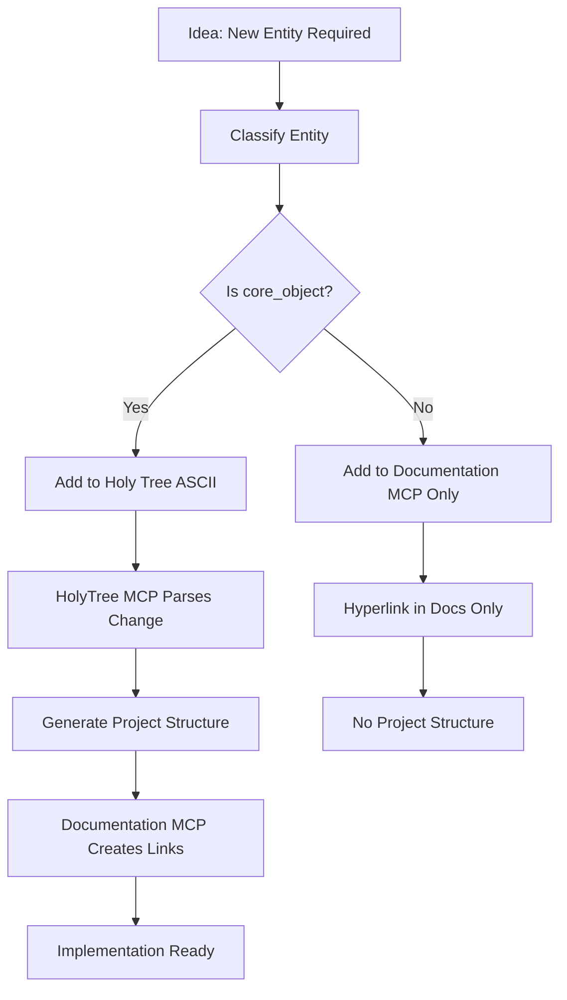
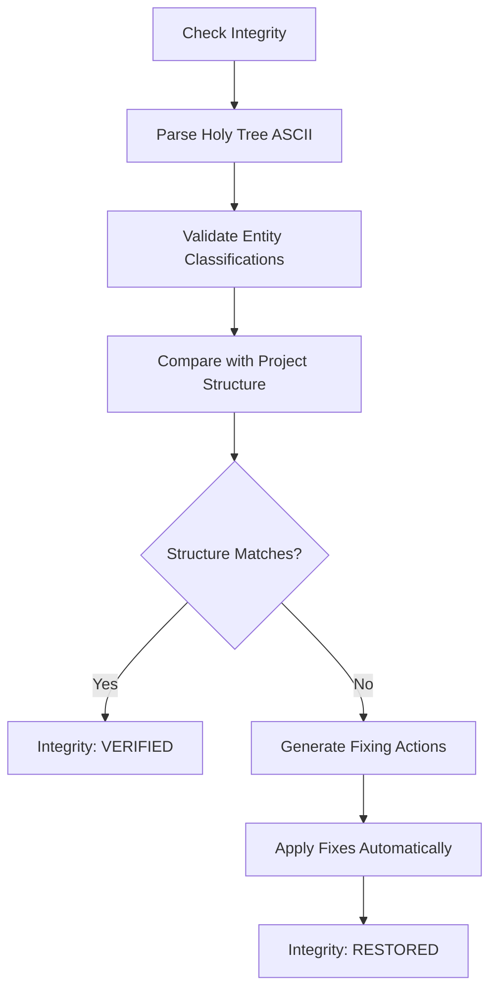

# HolyTree MCP - The Sacred Architecture Canon

## 🏛️ **The Holy Tree: Living Architectural Constitution of ROMILLM**

**The Holy Tree MCP serves as the supreme architectural authority where:**

1. **📜 ASCII Tree Structure is MONETARY LAW** - The hierarchical numbering defines architectural truth
2. **🏗️ All Structural Decisions Flow from Classification** - Entity classification determines project reality
3. **🔄 Real-Time Project Structure Generation** - ASCII changes automatically generate physical directories
4. **📋 Developer Guidance from Canonical Source** - Holy Tree provides implementation roadmap

## 🎯 **Holy Tree Principles**

### **Axiom 1: ASCII Tree Supremacy**
```ascii
# The ASCII Tree in ROMILLM_Architecture/ProjectStructure.md IS the canonical source
# No project structure exists without ASCII tree representation
# No entity gets structure unless classified as core_object with ascii_tree: true

ROMILLM_Project/                    # Root (HOLY TREE LEVEL 0)
├── 1️⃣ Core_Orchestration/          # DOMAINS (HOLY TREE LEVEL 1)
│   ├── 1.1 Pipeline_Manager/         # OBJECTS (HOLY TREE LEVEL 2)
│   │   ├── 1.1.1 Config/             # LAYERS (HOLY TREE LEVEL 3)
│   │   ├── 1.1.2 Toolbox/
│   │   ├── 1.1.3 Core/
│   │   ├── 1.1.4 Api/
│   │   └── 1.1.5 Tests/
```

### **Axiom 2: Classification Determines Reality**
- **core_object** → Holy Tree inclusion + Project structure generation
- **conceptual_entity** → Documentation hyperlinks only
- **waitlist_entity** → Marking for future Holy Tree inclusion
- **blacklist_entity** → No architectural consideration

### **Axiom 3: Bidirectional Synchronization**
```
Holy Tree Change → HolyTree MCP → Entity Classification Update → Project Structure Generation
                               ↗️
Project Structure Change → Classification Update → Holy Tree Mirror
```

## 🔧 **HolyTree MCP Tools**

### **analyze_holy_tree**
Parses Holy Tree and validates architectural consistency
```json
{
  "name": "analyze_holy_tree",
  "input": {
    "holy_tree_path": "ROMILLM_Architecture/ProjectStructure.md",
    "validation_mode": "strict"
  },
  "output": {
    "entities_found": ["Core_Orchestration", "Pipeline_Manager", ...],
    "classifications_matched": true,
    "structural_integrity": "VALID",
    "recommendations": ["No changes required"]
  }
}
```

### **generate_project_from_holy_tree**
Auto-generates project structure from Holy Tree ASCII
```json
{
  "name": "generate_project_from_holy_tree",
  "input": {
    "holy_tree_path": "ROMILLM_Architecture/ProjectStructure.md",
    "target_root": "ROMILLM_Project/",
    "create_mode": "incremental"
  },
  "output": {
    "directories_created": ["ROMILLM_Project/Domain/Object/Layer/"],
    "files_generated": ["README.md", "CMakeLists.txt"],
    "sync_status": "COMPLETE"
  }
}
```

### **validate_architecture_consistency**
Ensures project structure matches Holy Tree exactly
```json
{
  "name": "validate_architecture_consistency",
  "input": {
    "holy_tree_path": "ROMILLM_Architecture/ProjectStructure.md",
    "project_root": "ROMILLM_Project/",
    "deep_validation": true
  },
  "output": {
    "tree_project_match": "PERFECT",
    "missing_directories": [],
    "extra_directories": [],
    "integrity_score": "100%"
  }
}
```

### **add_entity_to_holy_tree**
Adds new entity to Holy Tree with proper classification
```json
{
  "name": "add_entity_to_holy_tree",
  "input": {
    "entity_name": "New_Component",
    "classification": "core_object",
    "domain": "Ingestion_Pipeline",
    "proposed_number": "2.4",
    "layers": ["Config", "Toolbox", "Core", "Api", "Tests"]
  },
  "output": {
    "holy_tree_updated": true,
    "project_structure_generated": true,
    "documentation_links_created": true,
    "implementation_guide": "Path: Complete"
  }
}
```

### **remove_entity_from_holy_tree**
Removes entity and cleans up all related structures
```json
{
  "name": "remove_entity_from_holy_tree",
  "input": {
    "entity_name": "Obsolete_Component",
    "cleanup_mode": "archive"
  },
  "output": {
    "holy_tree_cleaned": true,
    "project_structure_removed": true,
    "documentation_links_cleaned": true,
    "archive_created": "ROMILLM_Project/archived/Obsolete_Component/"
  }
}
```

## 📋 **Holy Tree Canonical Structure**

The Holy Tree follows **strict hierarchical numbering** where:

### **Level 0: Root Declaration**
```ascii
ROMILLM_Project/                    # 🎯 Sacred root directory
```

### **Level 1: Domain Declaration**
```ascii
├── 1️⃣ Domain_Name/                 # 🎯 Domain: Architectural classification
│   └── 📄 README.md                # 📜 Domain constitution document
```

### **Level 2: Object Declaration**
```ascii
├── 1.1 Object_Name/               # 🎯 Object: Implementation component
```

### **Level 3: Layer Declaration**
```ascii
│   ├── 1.1.1 Config/             # 📦 Layer 3: POD DTOs (Config)
│   ├── 1.1.2 Toolbox/            # 🛠️ Layer 1: Pure algorithms (Toolbox)
│   ├── 1.1.3 Core/               # 💼 Layer 3: Stateful logic (Core)
│   ├── 1.1.4 Api/                # 🎯 Layer 4: Public contracts (Api)
│   └── 1.1.5 Tests/              # 🧪 Layer 5: Validation tests (Tests)
```

## 🔄 **Holy Tree Workflow Integration**

### **Adding a New Component**


### **Structural Integrity Check**


## 🏛️ **Holy Tree Governance**

### **Holy Tree Amendments**
- **READ-ONLY EXCEPT MCP:** Holy Tree modified only through MCP tools
- **CLASSIFICATION REQUIRED:** All changes must include entity classification
- **STRUCTURAL VALIDATION:** Every change validated against project reality
- **VERSION CONTROL:** Holy Tree changes automatically committed with project changes

### **Architectural Senate**
- **Documentation MCP:** Manages documentation updates and hyperlinks
- **Classification System:** Provides entity classification authority
- **Project Structure Generator:** Creates physical directories from Holy Tree
- **Validation Oracle:** Ensures Holy Tree consistency with project reality

## 🚀 **Holy Tree Liberation**

**The Holy Tree MCP transforms ROMILLM from:**
```
❌ Architecture is documentation scattered across various docs
✅ Architecture IS the Holy Tree - single source of structural truth
✅ Changes propagate from Tree → Project → Documentation automatically
✅ Holy Tree guides all architectural and implementation decisions
```

**ROMILLM's architecture now governed by Sacred Holy Tree law!** 🏛️🌟⚖️

---

**Holy Tree MCP Version:** 1.0 | **Status:** SACRED LAW | **Authority:** SUPREME
